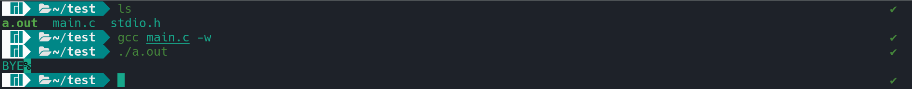
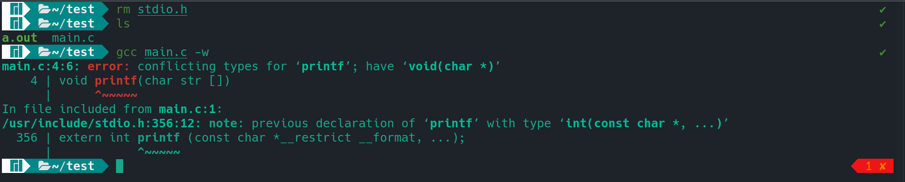

# Headers and Libraries

Header files and Libraries are common in programming languages and most of them
would know what they mean and yet some get confused by the terms itself.


A header file consists of all the prototypes,symbols and macros of a library
while a library consists of all the definitions of the functions. Now in linux
we can say a header file could be ```<stdio.h>```and the corresponding library would
be ```libc.so.6```, you can find the header file at ```/usr/include/``` and find the libraries
at ```/usr/lib/``` and some libraries needs be specifically be linked when with gcc
while compiling the program so let's say you write a program relating to some
mathematical operation and use some math functions (```sqrt()```,```pow()```,..) and then 
while compiling the program you have to add the ```-lm``` flag that's nothing but 
libm.so.6 and similary we have to specifiy the thread library (```-lpthread```) 
while writing out multi-threaded programs.


while writing programs the first line is usually the header file.
The declaration can be done like ```#include <stdio.h>``` or like ```#include"stdio.h"```, 
now the question arises what would be difference between these two? one would 
say just the angular brackets and the quotation marks but what does that signify?


To keep it simple we can say that the angular brackets(```< >```) tips the compiler
to search the particular header file in the default directory ```/usr/include/```.
while the double quotations(```" "```) tips the compiler to search for the header
file in the current directory and if it doesn't find it there then it tries
to find it in the default path (```/usr/include```). quotations are mostly used for
user defined header files and libraries but if you place your header files and
libraries in the default path (```/usr/include/``` and ```/usr/lib/```) then the angle
brackets should just work fine with it (PS: don't forget to link the library
while compiling).


okay let's go on with some examples and try to define our own ```printf()``` ;).
first lets declare the prototype of our own ```printf()``` in ``` stdio.h```

```c
//stdio.h
void printf(char str[]);

```
and now define our function within ```main.c```. keep in mind that ```main.c```
and our ```stdio.h``` should in the same level or directory.

```c
#include "stdio.h"
#include "fcntl.h"

void printf(char str[])
{
	int fd = open("/dev/stdout",O_WRONLY);
	int i;
	for(i=0;i<3;i++)
	{
		write(fd,str[i],1);
	}
	close(fd);
}
void main()
{
	printf("BYE. running default printf\n");
}
```
and here's the ouput.





here as for demonstration purposes I have just printed the first three characters
so that we can verify that our defined ```printf()``` is been executed and not the
default one. let's go on explaining the program. so as we are defining ```printf```
of our own we can't use the default ```printf()``` to print the output to the console.
so what I did is opened a file which is already defined within the operating system
```/dev/stdout``` now ```stdout,stdin,stderr``` are files which responsible for
the I/O operations within the system. writing something to ```stdout``` would display
the characters to the console similarly writing something to ```stdin``` would considered
as taking input from the console and ```stderr``` is responsible for displaying error
to the console. so here we open the the ```stdout``` file and only write the first three
characters of the passed argument into the file and after closing the file the output is
displayed to the console.





now if we remove the ```stdio.h``` from the directory and then compile the program
we would get an error of conflicting types. this is because the compiler couldn't
find a ```stdio.h``` header file in the current directory so it goes to the default
path ```/usr/include/``` and there it finds the header file but issue arises our function
doesn't matches the prototype defined in the header file so a conflict arises and hence
an error message gets displayed.


if you have any clarifications or rectification in the blog feel free to reach out :)
