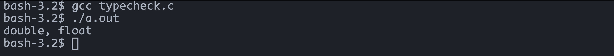

# Floating Numbers

Usually we don't deal much with floating numbers on a daily basis but this one's
in particularly interesting.

Consider this program:

### main.c

```c
#include "stdio.h"

int main()
{
    float x = 4.2;

    if(x == 4.2) {
        printf("EQUAL!");
    }
    else {
        printf("NOT EQUAL!");
    }

}
```

### Output of main.c


Let me explain this. So the 4.2 on the right hand side of the equality
operator is a double and the 4.2 on the left hand side is a float. 

Don't believe me? Let's prove my claim. Below is a program that uses 
`_GENERIC()`keyword and an enumeration to check the type of both l-value and 
r-value of the equality operator in the above program. For more details, check
[this link](https://docs.microsoft.com/en-us/cpp/c-language/generic-selection?view=msvc-170)

### typecheck.c
```c
#include <stdio.h>

#define typename(x) _Generic((x), float: "float", double: "double", default: "other")

enum t_typename {
    TYPENAME_FLOAT,
    TYPENAME_DOUBLE,
    TYPENAME_OTHER
};

int main() {
    float someFloatValue = 1.1;
    printf("%s, %s", typename(1.1), typename(someFloatValue));
}
```

### Output of typecheck.c


Okay, that was quite a segue. Let's dive a bit deeper into this, and understand 
why this is happening. To understand things better, let's turn these values into 
binary and see exactly what's happening.

```c
float (32 bits) --> 4.2 --> 0100 . 0011 0011 0011 0011 0011 0011 0011
double (64 bits) --> 4.2 --> 0100 . 0011 0011 0011 0011 0011 0011 0011 0011 0011 0011 0011 0011 0011 0011
```

**KEEP IN MIND**: this is just for the sake of brevity. This not exactly how the 
bits are stored in memory.  I'll write about the binary memory representation 
of floating numbers in a different article. So, we can clearly see that the 
number of bits are unequal and that's why the condition becomes false and 
control goes to the else statement. changing the 4.21 of the right hand side 
of the equality operator to ```4.21f``` will make the condition true for the 
if block. Incase you are wondering how to convert the floating point to binary 
(i.e. 0.2) here is a representation of it.

```
0.2*2=0.4 -> 0 
0.4*2=0.8 -> 0 
0.8*2=1.6 -> 1 
0.6*2=1.2 -> 1 
0.2*2=0.4 -> 0 
.
.
.
```

Let's re-write the main program with a different value this time

### main.c
```c
#include "stdio.h"

int main() {
    float x = 4.5;

    if(x==4.5) {
        printf("EQUAL!");
    }
    else {
        printf("NOT EQUAL!");
    }
}

```

### Output for main.c


Interesting right? Just by changing the number we get a different output.
Let's convert `4.5` to binary to get a better understanding of what's
happening exactly.

```c

float (32 bits) --> 4.5 --> 0100 . 0100 0000 0000 0000 0000 0000 0000
double (64 bits) --> 4.5 --> 0100 . 0100 0000 0000 0000 0000 0000 0000 0000 0000 0000 0000 0000 0000 0000

```
So, we can see here there is no repetition of bits. It's just 0's after the first 
two bits after the floating point hence the condition turns out to be true and 
the first condition gets executed.


If you need any clarifications or have suggestions for the blog, feel free to reach out :)

The blog page is open source, and you are free to open a pull request on [GitHub](https://github.com/saitama951/blogs)
